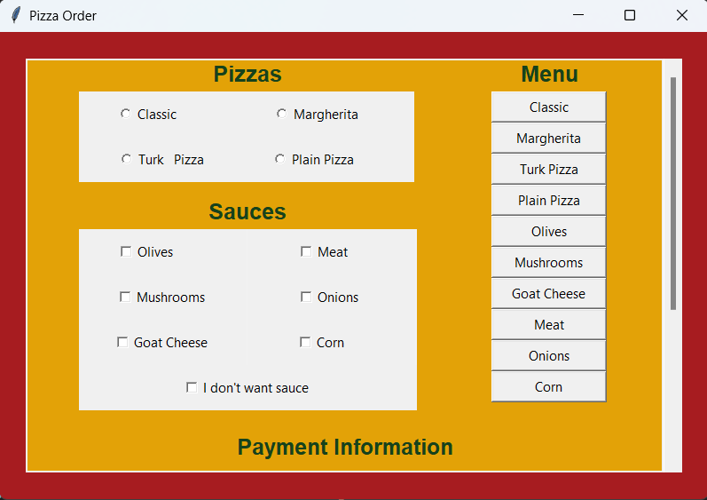
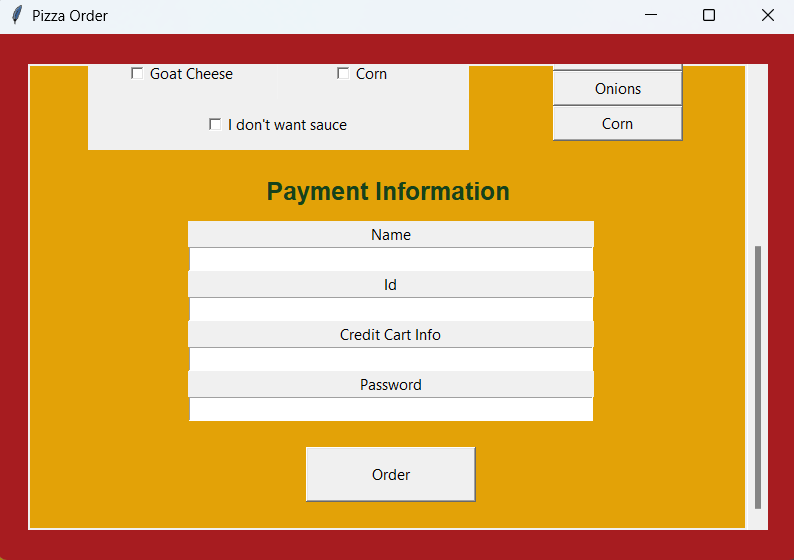
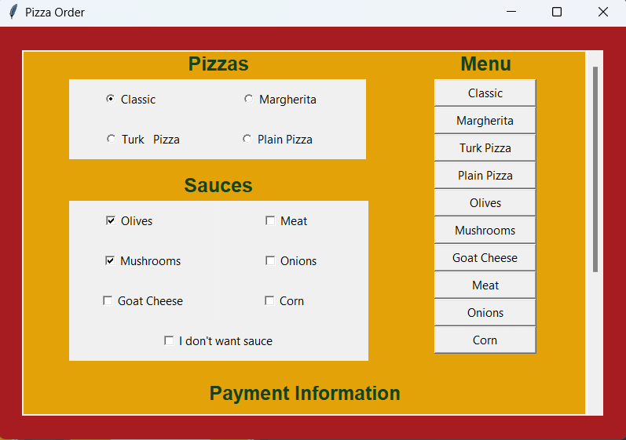
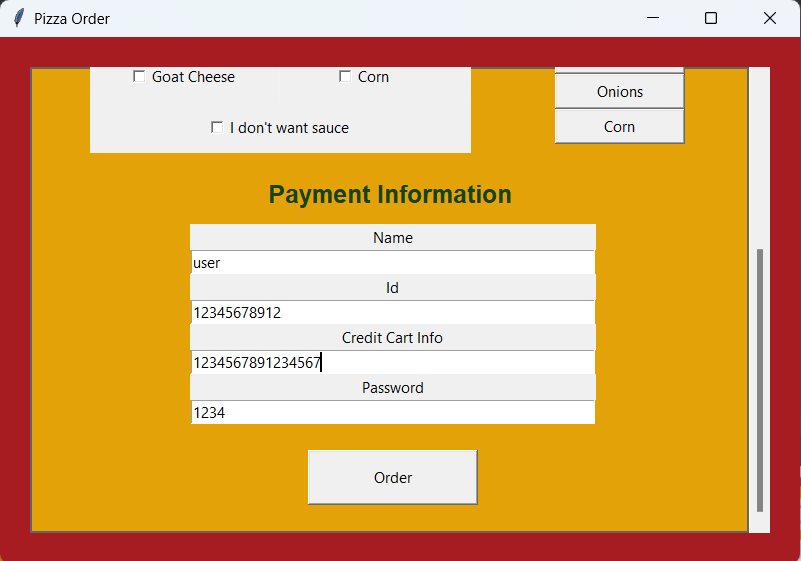
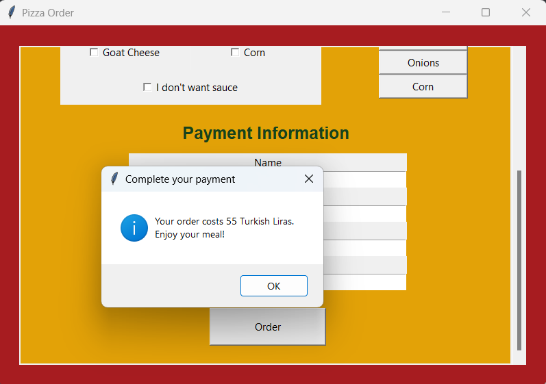
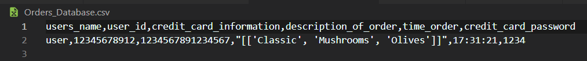
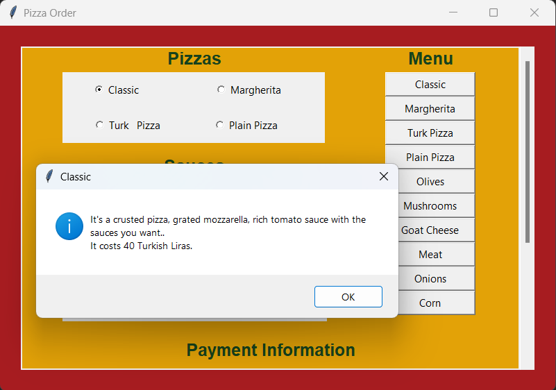
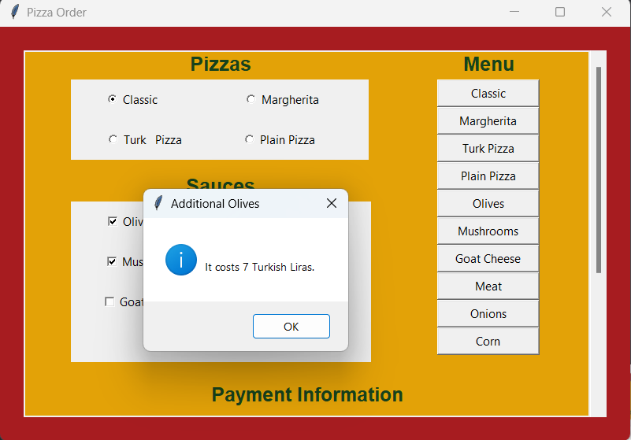

***This is an interface for a pizza ordering system.***

I wanted to show you how it looks in my pc just in case it looks different for you-because I guess tkinter makes it look different for some reasons-.

- So here is the first part of our gui. There are our pizza choices as radiobuttons, sauce choices as checkboxes and lastly our menu which is filled with buttons.

   

- And the second part of the gui looks like this. There are payment details and and order button.

   

❔**So how does our gui work?** 

✅Let's order a pizza to see this.

+ Here we chose Classic pizza as our pizza and olives and mushrooms as our sauces. And then we entered our informations, when we pressed the order button and the pop-up message appeared and showed us the cost of our order. 

   

      
       
   

   

       
   

   
 + Also our program stores the information datas. This is how our order looks in the csv file.
 
   
   
 + Last but not least, on our menu we have our pizzas and sauces. You can see the descriptions and prices of the pizzas and the prices of the sauces on a pop-up message if you press the buttons you want.

   

      
       
   

 

